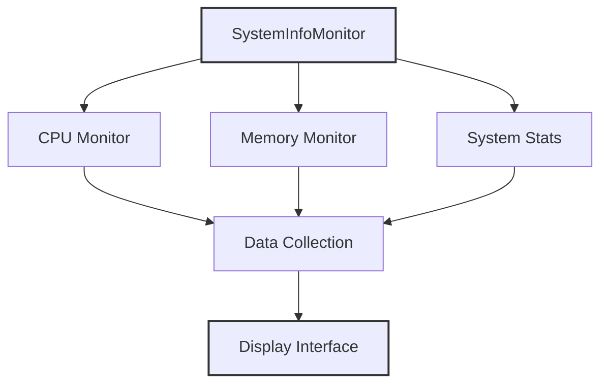
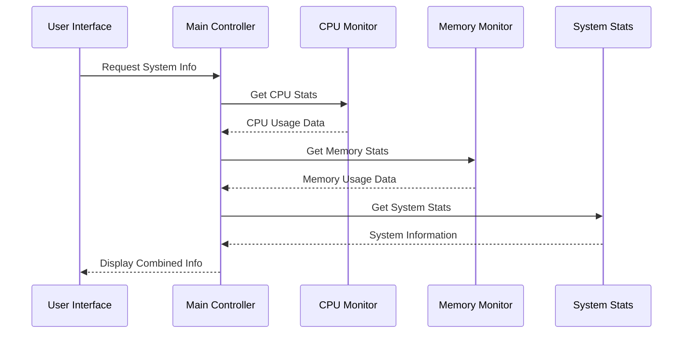
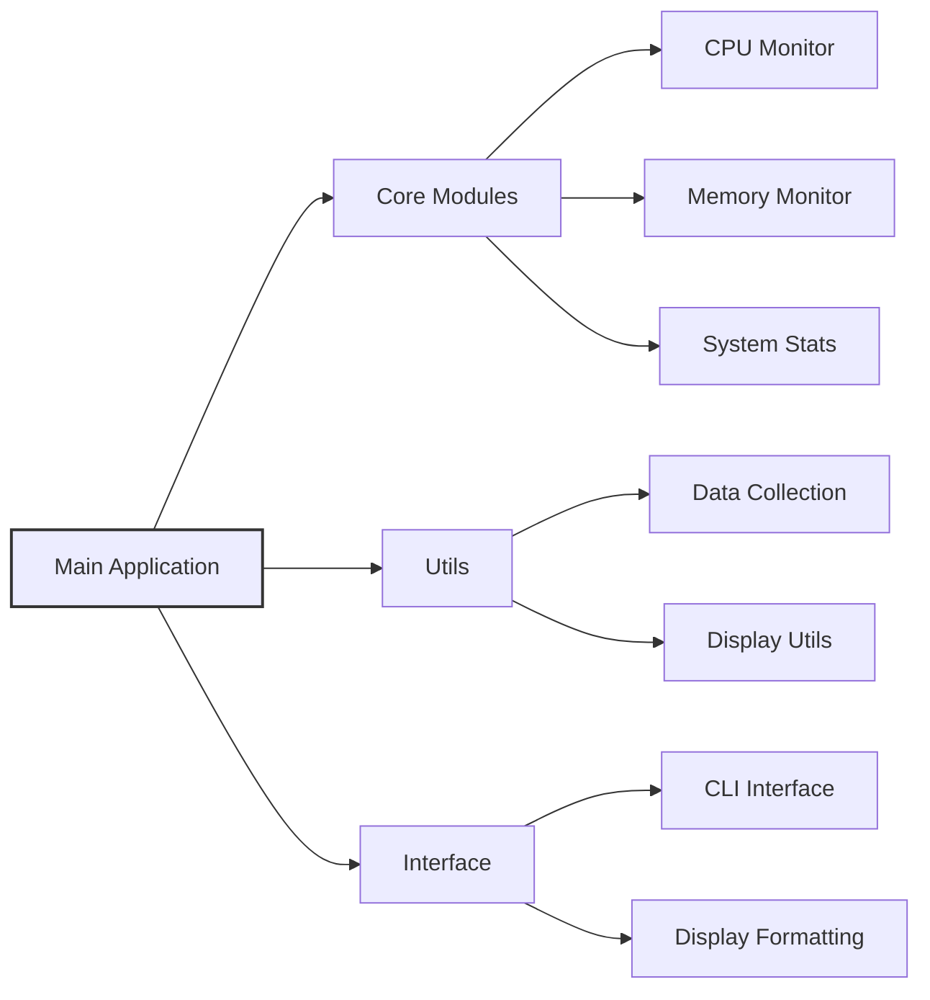
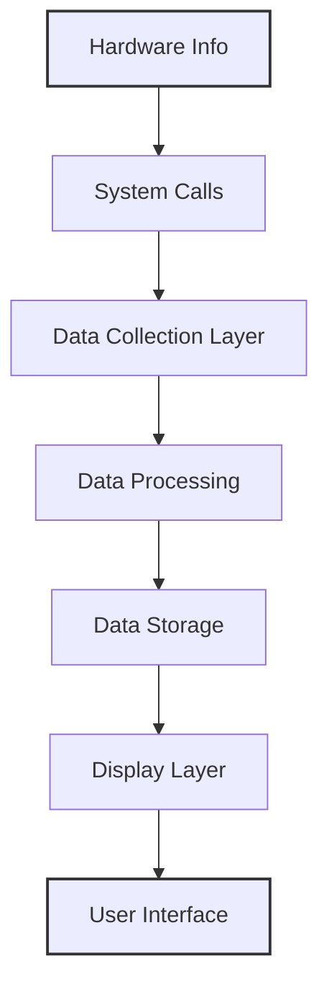

# System Architecture Documentation

This document outlines the architecture and components of the SystemInfoMonitor application.

## High-Level Architecture

The following diagram shows the high-level architecture of the SystemInfoMonitor:

## Component Flow

The following diagram shows the data flow between components:

## Module Structure

Here's the module organization of our application:

## Data Flow Architecture

This diagram shows how data flows through the system:

## Implementation Details

The SystemInfoMonitor is implemented in `C` and uses the following key components:

1. **Core Monitoring**
   - CPU usage tracking
   - Memory utilization
   - System statistics collection

2. **Data Management**
   - Real-time data collection
   - Data processing
   - Storage handling

3. **User Interface**
   - Command-line interface
   - Data visualization
   - User interaction handling 